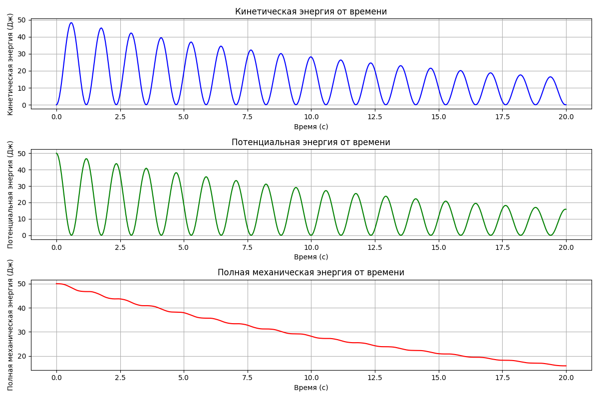

# Задание к лекции №8
>Энергетические превращения при колебании груза на пружине. Входные данные: масса
груза, коэффициент жесткости, коэффициент сопротивления среды (сила сопротивления
пропорциональная скорости). Итоговый вид: графики зависимости кинетической,
потенциальной и полной механической энергии от времени. 

## Теоритическая часть

***Полная механическая энергия*** — это сумма кинетической и потенциальной энергии тела.

Когда груз совершает колебания на пружине, на него действуют:
1. **Сила упругости пружины**:  $F_{упр} = -kx$
2. **Сила сопротивления среды**: $F_{сопр} = -bv$

С учетом второго закона Ньютона можно записать уравнение движения для груза:

$m \frac{{d^2 x}}{{dt^2}} + b \frac{{dx}}{{dt}} + kx = 0$

где:
- $x(t)$ — положение груза в момент времени \( t \),
- $\frac{{dx}}{{dt}}$ — скорость груза,
- $\frac{{d^2 x}}{{dt^2}}$ — ускорение груза.

Это дифференциальное уравнение второго порядка описывает колебания груза с затуханием. В зависимости от значений \( m \), \( k \) и \( b \) колебания могут быть как колебательными, так и апериодическими (если сопротивление достаточно велико).

### Формулы
Для расчета кинетической, потенциальной и полной механической энергии используются следующие формулы:

1. **Кинетическая энергия** $E_{к}$:
   
   $E_{к} = \frac{1}{2}mv^2$

   где  $v = \frac{{dx}}{{dt}}$ — скорость груза.

2. **Потенциальная энергия** $E_{п}$:
   $E_{п} = \frac{1}{2}kx^2$

   где $x$ — отклонение от положения равновесия.

3. **Полная механическая энергия** $E$:
   $E = E_{к} + E_{п}$

При наличии сопротивления среды полная механическая энергия уменьшается со временем, что демонстрирует затухание колебаний.

## Пример

*Входные данные:*
+ Масса груза $(кг)$: 14
+ Коэффициент жесткости пружины $(Н/м)$: 100
+ Коэффициент сопротивления среды $(Н·с/м)$: 0.8

*Выходные данные:*

## Источники
[Foxford](https://foxford.ru/wiki/fizika/zakon-sohraneniya-mehanicheskoy-energii?utm_referrer=https%3A%2F%2Fwww.google.com%2F)
[interneturok](https://interneturok.ru/lesson/physics/10-klass/bzakony-sohraneniya-v-mehanikeb/mehanicheskaya-energiya-zakon-izmeneniya-sohraneniya-mehanicheskoy-energii)
[studfile.net](https://studfile.net/preview/9123509/page:3/)